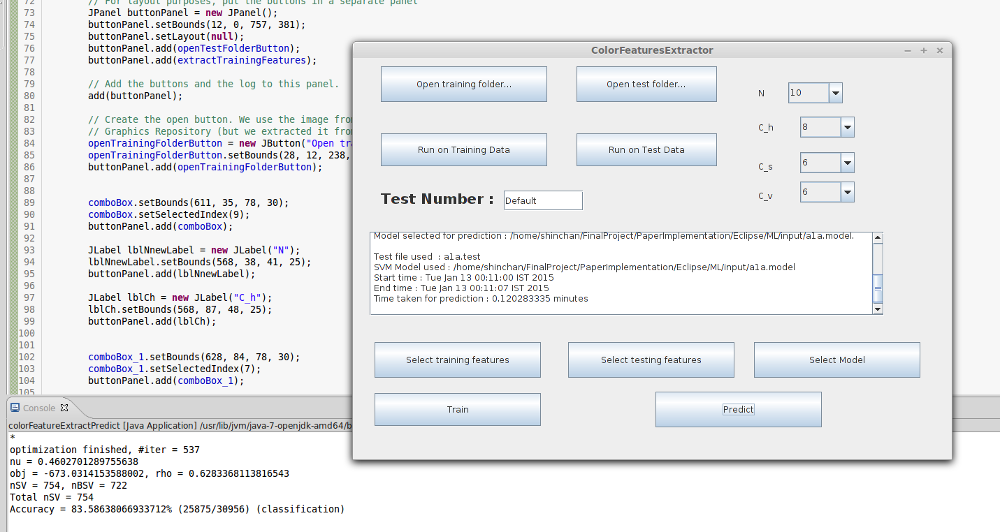

# Using Color Features to Classify Images

We here use the Color Feature extraction method present in the paper ["Machine Learning Attacks Against the Asirra CAPTCHA"](http://xenon.stanford.edu/~pgolle/papers/dogcat.pdf) to create a simple and easy to use interface for automatic image classification. We assume the users of this application have read this paper and are familiar with the basic idea of how it works.

Here is a list of data sets on which we have tested it and the accuracy we have obtained :-

1. [Cat Dog Data](https://www.kaggle.com/c/dogs-vs-cats/data)

Feature Set| N | Cs | Ch | Cv |  #features  |Total Images|Training Images|Accuracy|
:---------:|:-:|:--:|:--:|:--:|:-----------:|:-----:|:--------:|:--------:|
F1|1|10|10|10|1000|5000|4000|65.9%
F2|3|10|8|8|5760|5000|4000|71.5%
F3|5|10|6|6|9000|5000|4000|70.9%|
F4|5|10|6|6|9000|10,000|8000|73.05%|

We also tried it on the following [Kaggle Contest](https://www.kaggle.com/c/dogs-vs-cats/) for classifying images into whether they are cats or dogs and attained an accuracy of 0.74297. 

!Kaggle Result[PaperImplementation/sample/kaggleTest2Result.png]

## [Link to the latest release : GUI Version 2](https://github.com/sjs7007/FinalProject/blob/master/PaperImplementation/jarReleases/GUI2ML.jar)

## How to start the application?

### On a terminal
+ You can just download it and cd to the location.
+ Then run the following command :
	```
	java -jar GUI2ML.jar
	```
+ We suggest you use this method preferrably since some extra logs are outputted on terminal which will not be visible if you use the other methods below.

### Direct GUI method on windows
+ First try double clicking on the jar file. If it doesn't work directly, perform the following steps: - 
	+ Start "Control Panel"
 	+ Click "Default Programs"
 	+ Click "Associate a file type or protocol with a specific program"
	+ Double click .jar.
	+ Browse C:\Program Files\Java\jre7\bin\javaw.exe.
	+ Click the button Open.
	+ Click the button OK.
	+ From now on you should be able to use the application just by double clicking it.

### Direct GUI method on Ubuntu/Mint
+ Right click the file, go to permissions and check the "Allow executing file as a program".
+ Now go to open with tab and select Open JDK <your java version number> runtime and click on set as default.
+ From now on you should be able to use the application just by double clicking it.



## How to use the application? 

1.Feature Extraction 

+ Training Data
	+ Select folder which has training images. The images should be of 250*250 resolution and should have their label as a part of their name. For e.g. an image of a dog must have dog as a substring in its file name, like dog.54.jpg or dog.78.jpg 
	+ If your input data is not of 250*250 resolution, you can use this [script](https://github.com/Safadurimo/cats-and-dogs/blob/master/resize.sh) to resize your images. 
	+ Click on train then. The extracted features will be stored in a file of extension .train inside results folder. You can choose to modify the default file names by using the "Test Number" field.

+ Test Data
	+ Similar steps as above except you use the buttons for test data and the result is stored in a .test file.

2.Training 

+ Select the features files by clicking the "Select training features" button. 
+ Click on train next.
+ A trained model is generated and is stored in the results folder in a file of extension .model.

3.Testing/Prediction

+ Select test features by clicking the "Select testing features" button.
+ Select the model to be used for testing. If no model is selected, by default, the model generated in training step is used.
+ Click on predict.
+ The results are generated and stored in a .results file inside the results folder. If the input data used for testing was labelled, a meaningful classification accuracy value is also outputted on the terminal else the value generated is just arbitrary. 

