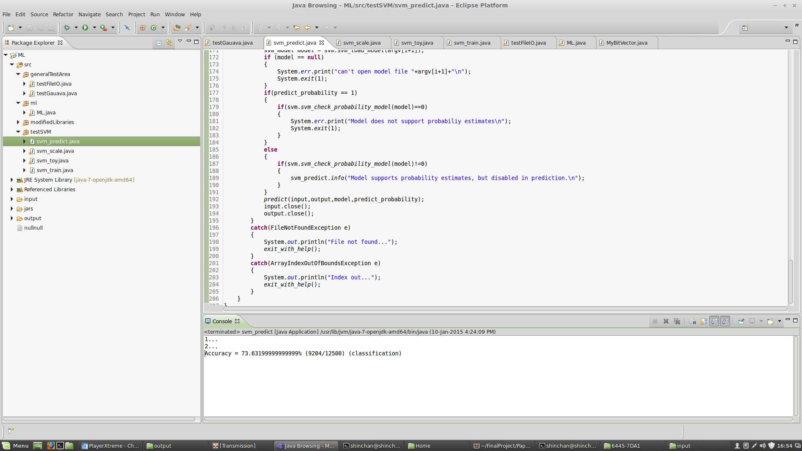
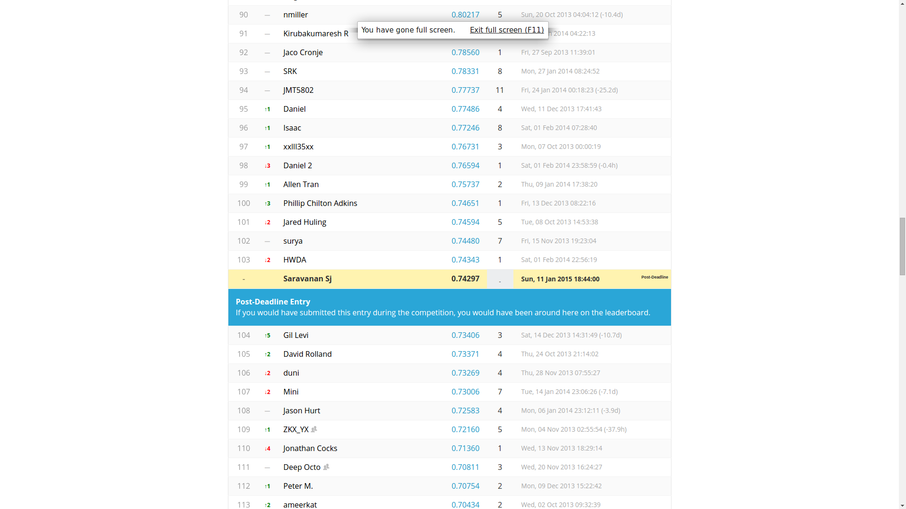
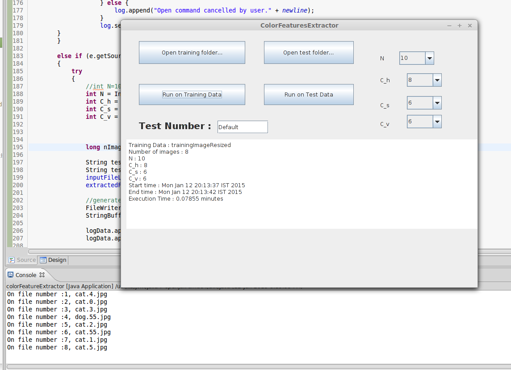

Doing it in Java to ensure easy portability to android later.

1. Implement SVM for color features first. 

Step 1 : 

+ Load image into Java and get RGB values.
	+ [Image2RGB](http://www.tutorialspoint.com/java_dip/understand_image_pixels.htm)
+ Convert RGB to HSV.
	+ [RGB2HSV](http://stackoverflow.com/a/2399174)
+ Check if conversion is proper by convertion hsv to rgb back to image file.
	+ [How to write RGB image as file](http://www.lac.inpe.br/JIPCookbook/1300-create-rgb.jsp)
	+ [How to convert int RGB to array : use color constructor](http://docs.oracle.com/javase/7/docs/api/java/awt/Color.html)
	+ [HSV2RGB](http://docs.oracle.com/javase/7/docs/api/java/awt/Color.html#HSBtoRGB(float,%20float,%20float))

	Result : succesful, but color seems to change for seem reason. WHY?

	
	

	Fixed : RGB order was off. No more problem now. 

Step 2 : 

+ Cell size = 250/N.
+ Split each h,s,v into c_h, c_s and c_v bands of equal width.
+ Create feature vector of size(N*N*Ch*Cs*Cv) : data type bitvector.
+ extract cells from matrix : [code](trash/testExtractCells.java)
+ For each cell, say hsvCell,  store in FinalMat of data type MyBitMatrix, the boolean result for that particular cell.
+ Final feature vector : use data type BitVector. 

-----

Comparision of output from python and java 

[python code](pythonEasyCompare.py)    
[java code](ML.java)    
 
[diff for x = 256 on diff checker](https://www.diffchecker.com/ec85wi5z)

[python output](color_from_pythonx256.txt)
[java output](color_from_Javax256.txt)

###Color Features all done and working. Tested on dog 55 image.

Tested again on cat55 : 

[diff for x = 256 on diff checker on cat55](https://www.diffchecker.com/psca0yxo)

------

Step 3 : Figure out how to work with SVMs in Java.

+ Use LIBSVM from [here](http://www.csie.ntu.edu.tw/~cjlin/cgi-bin/libsvm.cgi?+http://www.csie.ntu.edu.tw/~cjlin/libsvm+zip).
	+ [LIBSVM's official page](http://www.csie.ntu.edu.tw/~cjlin/libsvm/)
	+ [Example video of using LIBSVM in Java](https://www.youtube.com/watch?v=gePWtNAQcK8)
	+ [To run train and predict in Eclipse you'll need to know how to load command line arguments in eclipse.](http://www.cs.colostate.edu/helpdocs/eclipseCommLineArgs.html)

	Steps :
	+ Run train.java with following 2 command line arguments : input training file, location and file name to store generated model.
	+ Run predict.java with following 3 command line arguments : input test file, model generated in earlier step, location and file name to store prediction output.

+ Now, next step is to make it work with your data.
	+ 1st you need to convert in format needed by libsvm. 
	+ [If in CSV..](https://nayefreza.wordpress.com/2013/09/18/converting-csv-file-to-libsvm-compatible-data-file-using-java/)
	+ Either convert step 2 output to CSV and then use above code or implement code to directly store in needed format of libsvm...
		CSV files can be easily viewed using excel and are displayed on github and this option will mean less code writing since above script is available....

	+ Data format of LIBSVM [here](http://stats.stackexchange.com/questions/61328/libsvm-data-format):

		```
		The data is stored in a sparse array/matrix form. Essentially, it means only the non-zero data are stored, and any missing data is taken as holding value zero. 

		In short, +1 1:0.7 2:1 3:1 translates to:

		Assign to class +1, the point (0.7,1,1).
		```

		Also each line should end with '\n'.

		So, for let's say label for cat : -1, dog: +1

		and there are 9000 features in total, so say if only feature 1,9,900 is true it will be stored as 

		1 1:1 9:1 900:1 for image of dog
	   -1 1:1 9:1 900:1 for image of cat

	   both will also have a '\n' at the end of the line.

	+ Before this, first modify main program "ML.java" to take multiple files as input and automatically detect using name whether cat or not.

	[Code for example file IO](PaperImplementation/Eclipse/ML/src/generalTestArea/testFileIO.java)
	Done!

	+ Now produce output in format needed for SVM. 

		+ Take as input allImageData and convert into libsvm format : toLibsvmFormat() method
			Done!

+ Next step : give actual data to train method!
	+ Seems to work, but images need to be converted to 250*250 resolution first.
		Use script from [here](https://github.com/Safadurimo/cats-and-dogs/blob/master/resize.sh) for it. Need to install "imagemagick" for mogrify.
		Done
	+ extract features in batch for training and store in Eclipse/ML/input/colorLIBSVMALL.train
	+ train and store model in Eclipse/ML/input/colorLIBSVMALL.model
	+ extract features in batch for testing and store in Eclipse/ML/input/colorLIBSVMALL.test
	+ Perform testing.
		+out of memory error on string builder.

+ What if test data labels are unknown?
	+ [official source](http://www.csie.ntu.edu.tw/~cjlin/libsvm/faq.html#f431)
	+ [source2](https://www.biostars.org/p/961/) 

	```
	I emailed libSVM's author and I thought it would be good to share with you the answer to my question...

	He told me that when you're doing the "actual" prediction, you just put random numbers as labels. It will still print out the "Accuracy=..." statement, which will, of course, be meaningless; the only thing that matters is svm-predict's output file containing the classification results.
	```
	+ features of 25k images are of around size 160MB so not uploading in git. [link to file on dropbox]()
	[Code used for it](https://github.com/sjs7007/FinalProject/commit/7157d3e96967c0c82fcd2337e8c884d94869bac7)
	+ split the 160mb file into 60-40 as 60% for training and 40% for testing
	+ so.. split 25k line data into 25k*.6=15k lines and 25k*0.4=10klines
		+ [splitting option 1](http://askubuntu.com/questions/411971/command-to-split-a-text-file-according-to-number-of-lines) : but this method does not allow 60-40
			+ just use this and do 50-50 for time being..
				+ Done!
				+ Data used :
					training : half.train
					testing : half.test
				+ Mode and result : 
					half.model
					half.result
				+ Accuracy : 73.63199999999999% (9204/12500)
				+ 

	+ removed all data files from git repo before uploading.


----

Step 4 : run on test data
+ Store text file of all image ids.
	+ [File name without extension.](http://stackoverflow.com/questions/924394/how-to-get-file-name-without-the-extension)
	+ [Read file line by line](http://stackoverflow.com/questions/5868369/how-to-read-a-large-text-file-line-by-line-using-java)
	+ [to CSV format](http://www.mkyong.com/java/how-to-export-data-to-csv-file-java/)
+ 

+ [How to take care of large file commited git issues](http://stackoverflow.com/questions/2100907/how-to-remove-delete-a-large-file-from-commit-history-in-git-repository)
Step 5 : Create GUI for above code.

+ Use [Window Builder](https://eclipse.org/windowbuilder/) in Eclipse.
+ [How to install?](https://eclipse.org/windowbuilder/download.php)
+ [jfile chooser](http://docs.oracle.com/javase/7/docs/api/javax/swing/JFileChooser.html)
+ [set defult directory to current](http://stackoverflow.com/questions/4871051/getting-the-current-working-directory-in-java)
+ [set at center of screen](http://stackoverflow.com/questions/9543320/how-to-position-the-form-in-the-center-screen)
+ [set min. size](http://stackoverflow.com/questions/2781939/setting-minimum-size-limit-for-a-window-in-java-swing)
+ [time difference](http://stackoverflow.com/questions/5911387/difference-in-time-between-two-dates-in-java)
+ [get current time](http://www.tutorialspoint.com/java/java_date_time.htm)
+ [create directory](http://www.mkyong.com/java/how-to-create-directory-in-java/)

How to use GUI

1. For extraction color features from training images:-

+ Select folder of images for training.
+ Set parameter values.
+ Set test number, if not chnaged default value is "default".
+ Results will be stored as text file inside results folder. Their names will be of this format :

	colorFeatureExtractor<testNumber>.list           
	colorFeatureExtractorTrain<testNumber>.log            
	colorFeatures<testNumber>.train           



2. For extraction color features from test images:-

	Same steps as above, except following files produced
	
	colorFeatureExtractor<testNumber>.list           
	colorFeatureExtractorTest<testNumber>.log            
	colorFeatures<testNumber>.test  

3. SVM Train

+ Select .train file for training 

Files generated : 
	
	SVMDefault.model
	SVMTrainDefault.log

4. SVM Predict

+ Select .model from previous step.
+ Select .test file.

Files generated : 
	SVMDefault.result
	SVMPredictDefault.log


[Ready jar of GUI2](/home/shinchan/FinalProject/jarReleases/GUI2ML.jar) 
[how to run jar files](http://stackoverflow.com/questions/5774970/run-jar-file-in-command-prompt)

```
java -jar <jar-file-name>.jar
```

Or in Ubuntu :
1. Allow executing file as program by right clicking.
2. Set default open with to open jdk run time.
