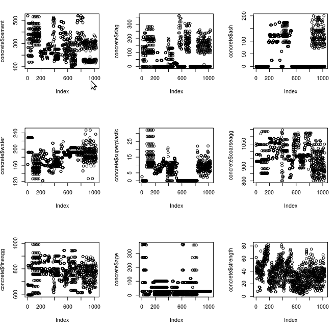
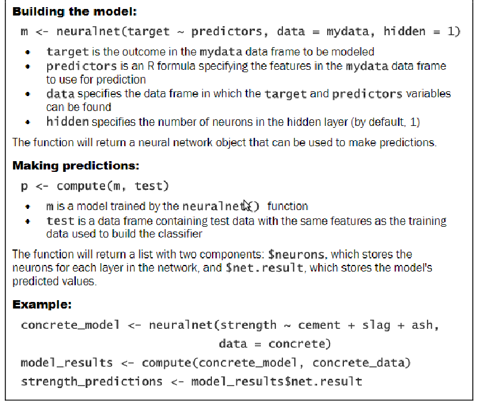
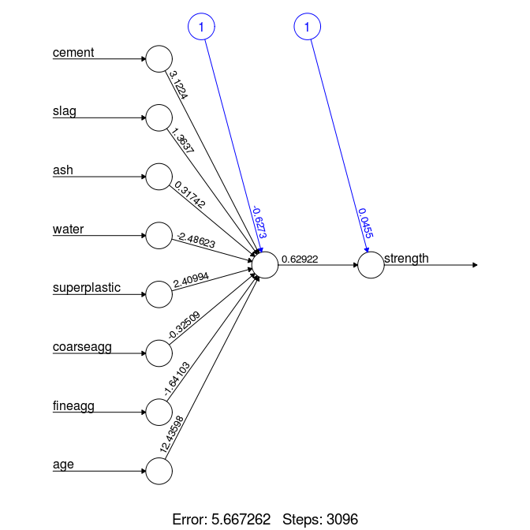
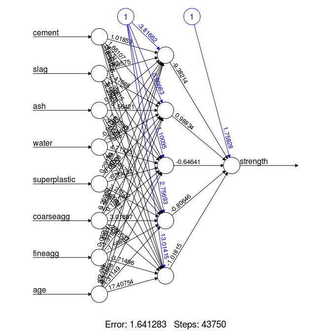

# Neural Network Example from ML with R book.

1.Step 1 : Collecting data.

2.Step 2 : Explore and prepare data.

```
concrete <-read.csv("concrete.csv")
str(concrete)
```

+ 2.1 : Preparing data.

	+ If the data is distributed in the form of a bellshape, scale() function inbuilt in R can be used.

	+ Else if the data follows a uniform distribution or is severly non-normal, then normalizing to 0-1 range may be more appropriate.

	+ Plot of data here :-

		

	+ Code used to plot :-

	```
	par(mfrow=c(3,3))                                                                                                             
	plot(concrete$cement)     
	plot(concrete$slag)  
	plot(concrete$ash)   
	plot(concrete$water) 
	plot(concrete$superplastic)
	plot(concrete$coarseagg)   
	plot(concrete$fineagg)   
	plot(concrete$age)   
	plot(concrete$strength)       
	```
	
	Note : find better way to plot later.

	+ Data seems to be uniformly distributed so normalizing to 0-1 range. Function for it:-

		```
		normalize <-function(x)
		{
			return((x-min(x))/(max(x)-min(x)))
		}
		```

	+ Apply it to data.

		```
		concrete_norm <- as.data.frame(lapply(concrete,normalize));
		```

	Note : Any transformation applied to the data prior to training the
	model will have to be applied in reverse later on in order
	to convert back to the original units of measurement. To
	facilitate the rescaling, it is wise to save the original data, or
	at least the summary statistics of the original data.

	+ Divide data into training set and test set. 75:25

	```
	concrete_train <- concrete_norm[1:773, ]
	concrete_test <- concrete_norm[774:1030, ]
	```

+ Step 3 : Training a model on data.

	+ Install and load needed package , neuralnet.

		```
		install.packages("neuralnet")
		library(neuralnet)
		```
	+ Syntax

	

	+ Build model, plot and save image. 

		```
		concrete_model <- neuralnet(strength ~ cement + slag + ash + water + superplastic + courseagg + fineagg + age, data = concrete_train)
		plot(concrete_model)
		savePlot("model.png")
		```

		

+ Step 4 : Evaluating Model Performance.

	+ Compute performance by giving it to model after removing the labels.
	+ The compute() function results a list with two components : neurons and results. Extract the latter.
	+ cor() function is then used to obtain a correlation between the two variables.

	```
	model_results <- compute(concrete_model, concrete_test[1:8])
	predicted_strength <- model_results$net.result
	cor(predicted_strength, concrete_test$strength)
	```

	Output : 0.7180

+ Step 5 : Improving Model Performance.

	+ Change number of neurons in hidden layer to 5 and build model.
	+ Plot the model.
	+ Save it.

	```
	concrete_model2 <- neuralnet(strength ~ cement + slag + ash + water + superplastic + coarseagg + fineagg + age, data = concrete_train, hidden = 5)
	plot(concrete_model2)
	savePlot("neuralArch2.png")
	```

	

	+ Evaluate performance again. 

	```
	model_results2 <- compute(concrete_model2, concrete_test[1:8])
	predicted_strength2 <- model_results2$net.result
	cor(predicted_strength2, concrete_test$strength)
	```

	Output : 0.7835

+[Link to showterm recording.](http://showterm.io/c97143f2bd50241b93a6b)
