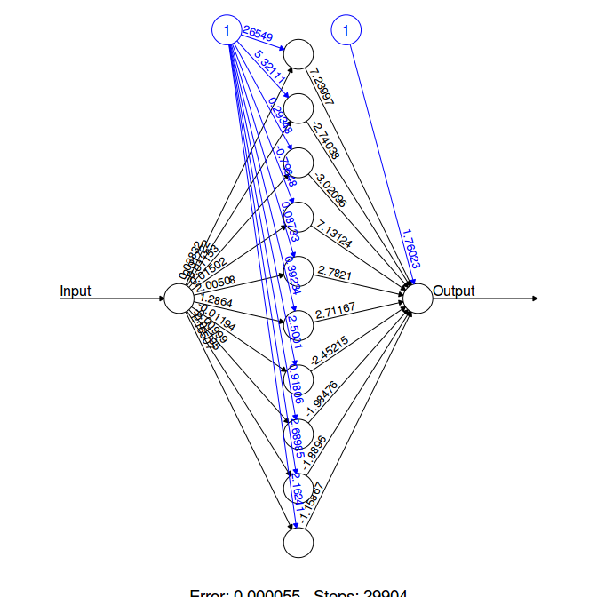

# Neural Network Square root in R.

+ [Source](http://gekkoquant.com/2012/05/26/neural-networks-with-r-simple-example/)

+ Code

```
#install.packages('neuralnet')
library("neuralnet")

#generate 200 random numbers between 0 and 1000 and store as data 
#frame

trainingInput <- as.data.frame(runif(30,min=0,max=300))
trainingOutput <- sqrt(trainingInput)

#combine output and input into one variable
trainingData <- cbind(trainingInput,trainingOutput)
colnames(trainingData) <- c("Input","Output")
str(trainingData)

#Train neural network.
#10 hidden layers.
#Threshold for error = 0.01

net.sqrt <- neuralnet(Output~Input,trainingData, hidden=10, threshold=0.01)
print(net.sqrt)

#plot the neural network and save it
plot(net.sqrt)
savePlot("netSqrt.png")

#testing on training data
testData <- as.data.frame(runif(10,min=0,max=300))
net.results <- compute(net.sqrt,testData)

#properties of net.sqrt
ls(net.results)

#print the results
print(net.results$net.result)

#Display a better version
cleanOutput <- cbind(testData, sqrt(testData),as.data.frame(net.results$net.result))
colnames(cleanOutput) <- c("Input", "Expected Output", "Neural Net Output")
print(cleanOutput)

```

+ 

+ [Showterm Recording.](http://showterm.io/d5d06e46401da421ff1b2)